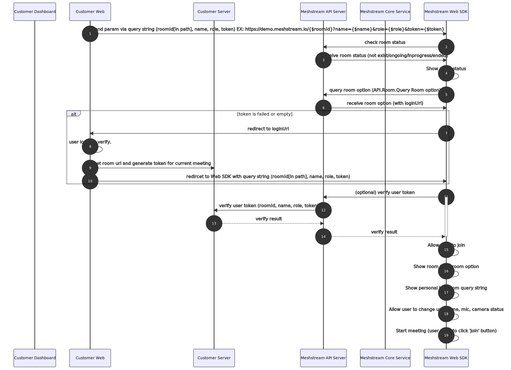

# Meshstream SDK
目前版本為2.1.8

1. Dashboard申請帳號
2. 建立會議兩種形式
3. 會議參數
4. 與會員系統的整合
5. 紀錄
6. SDK Sample
7. Apidoc

* Dashboard申請帳號
  * email
    * 寄信至 : service@meshub.io
    * 必填資訊：公司名稱 email 帳號 姓名
  * change password

* 建立會議兩種形式
  * 立即會議（介面操作，無API）

  * 建立專案預約會議

  
* 會議參數
  * 個人參數
  * 會議室參數
     * 整合會員系統
     * 介面
     * 推播

* Web SDK
  * 直接使用
  透過呼叫Web SDK API 可直接進行操作
    * Step 1: Login : 請參照 apidoc Auth.Login
    * Step 2: Create Project : 請參照 apidoc Project.Create
    * Step 3: Create Room : 請參照 apidoc Room.Create
    * Step 4: Get URL : 請參照 apidoc Room.RoomUrl.Get
    * Step 5: Open URL with Browser : 透過Browseru以及取得的RoomUrl 開啟Meeting Room 
  
  * 以iframe嵌入
  
    可透過iframe 嵌入 Room.RoomUrl 取得的網址，或者是透過Room.Query Room option中的ＵＲＬ，來開啟Meeting Room

* 與會員系統的整合
  * VerifyToken , LoginUI

    在原有的會員系統上增加VerifyToken 機制以及Login UI Page，
    就能夠進行會員系統與Meshstream 的串接。
  
  * Apidoc 詳細說明

    Apidoc :使用時需要先下載(./apidoc/)，再透過瀏覽器開啟./apidoc/index.html
  * 測試時可使用Meshstream會員系統

* 紀錄(今年二月release)
  * 使用者紀錄
  * Token
  * 頻寬使用

* SDK Sample
  * [快速上手版本](./api_sample)
  * 步驟：
    * 取得帳號
    * 從Dashboard或API建立專案
    * 從Dashboard或API建立會議室
    * 從活動網頁開啟會議室
    * 身份驗證
    * 取得使用紀錄
* [Apidoc](./apidoc/index.html )
