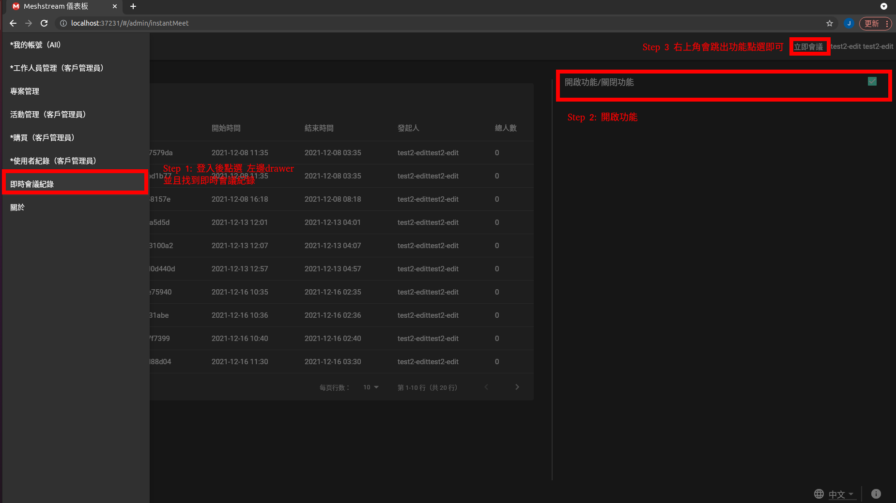
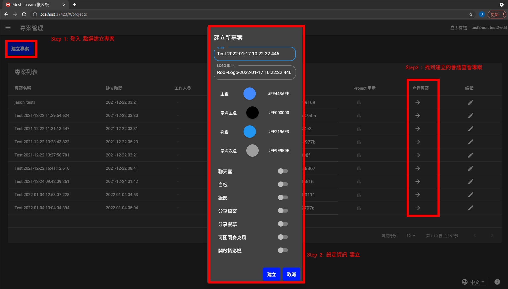
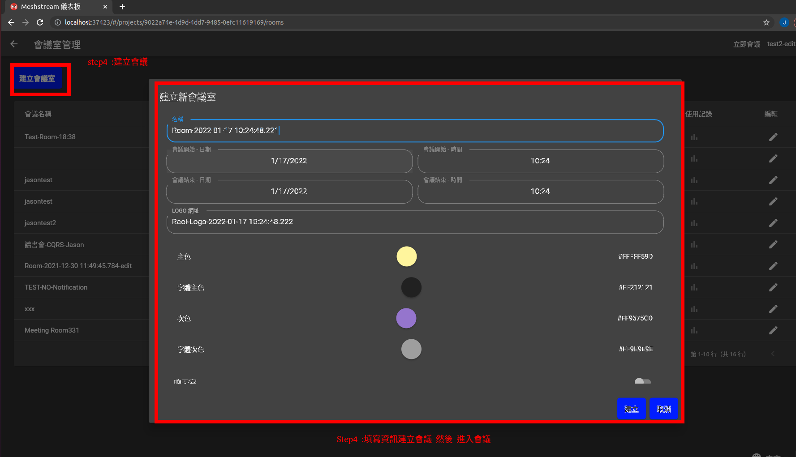
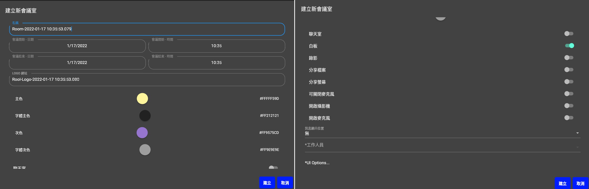

# Meshstream SDK

1. Dashboard申請帳號
2. 建立會議兩種形式
3. 會議參數
4. 與會員系統的整合
5. 紀錄
6. SDK Sample
7. Apidoc

* Dashboard申請帳號
  * emailrn
    * 寄信至 : service@meshub.io
    * 必填資訊：公司名稱 email 帳號 姓名
  * change password

* 建立會議兩種形式
  * 立即會議（介面操作，無API）

  * 建立專案預約會議

  
* 會議參數
  * 個人參數
  * 會議室參數
     * 整合會員系統
     * 介面
     * 推播

* Web SDK
  * 直接使用
  * 以iframe嵌入

* 與會員系統的整合
  * VerifyToken , LoginUI
  * Apidoc 詳細說明
  * 測試時可使用Meshstream會員系統

* 紀錄(今年二月release)
  * 使用者紀錄
  * Token
  * 頻寬使用

* SDK Sample
  * [快速上手版本](https://gitlab.com/instaapp.dev/sdk_sample/api_sample/-/blob/develop/index.js)
  * 步驟：
    * 取得帳號
    * 從Dashboard或API建立專案
    * 從Dashboard或API建立會議室
    * 從活動網頁開啟會議室
    * 身份驗證
    * 取得使用紀錄
* [Apidoc](./apidoc/index.html )
